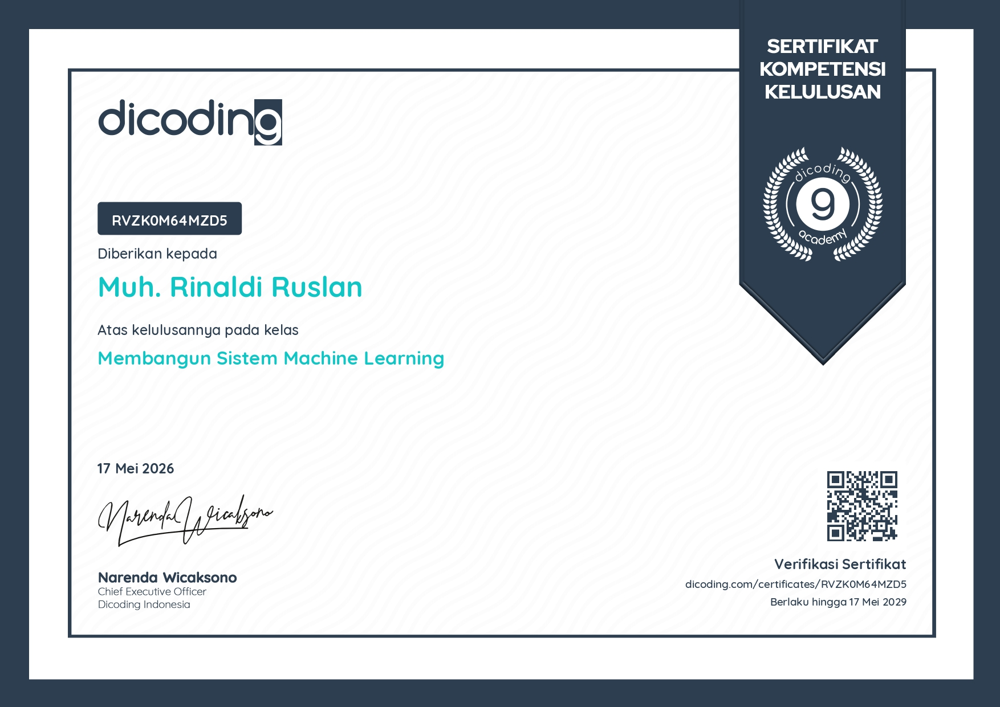
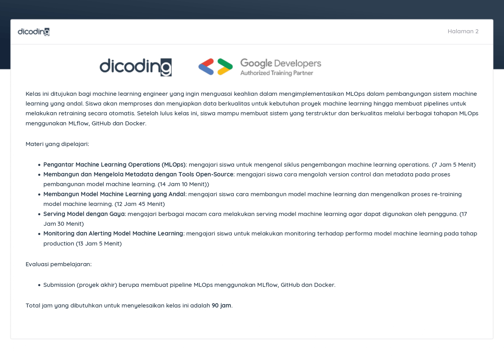

# 🫀 Heart Disease Prediction - Continuous Integration & Dockerization Pipeline (MLOps)

<p align="center">
  <a href="https://github.com/xebec51">
    
  </a>
  <a href="https://www.linkedin.com/in/rinaldiruslan">
    
  </a>
  <a href="https://www.instagram.com/rinaldiruslan/">
    
  </a>
  <a href="https://www.tiktok.com/@rinaldiruslan">
    
  </a>
  <br/>
  <a href="https://opensource.org/licenses/MIT">
    
  </a>
  
</p>

---

🌐 **Submission dari Kelas**:
[Membangun Sistem Machine Learning - Dicoding](https://www.dicoding.com/academies/713)

🏆 **Status Kelulusan**: Lulus dengan Predikat Memuaskan (Bintang 5 / Advanced)

### 🎓 Sertifikat Kelulusan Resmi
Sebagai bukti pemenuhan kriteria kompetensi tingkat lanjut (*Advanced*), berikut adalah sertifikat kelulusan dari Dicoding. *Klik pada gambar di bawah:*

<div style="display: flex; flex-direction: row; gap: 8px; justify-content: center; align-items: center;">
  <a href="https://www.dicoding.com/certificates/RVZK0M64MZD5" style="flex: 0 0 auto;">
    
  </a>
  <a href="https://www.dicoding.com/certificates/RVZK0M64MZD5" style="flex: 0 0 auto;">
    
  </a>
</div>

---

## 🔗 Ekosistem Proyek (End-to-End MLOps)

Proyek ini merupakan bagian dari arsitektur MLOps berskala produksi yang dipecah menjadi 4 repositori terpisah untuk merepresentasikan siklus kerja *microservices* dan integrasi sistem yang utuh:

1. 📊 **[Eksperimen & Preprocessing Data](https://github.com/xebec51/eksperimen_sml_rinaldi)**
2. 🧠 **[Pembangunan Model & MLflow Tracking](https://github.com/xebec51/mlsystem-heart-disease-rinaldi)**
3. ⚙️ **[Workflow CI/CD & Dockerization](https://github.com/xebec51/workflow-ci-rinaldi)** 📍 *(Anda berada di sini)*
4. 📈 **[Monitoring & Logging (Prometheus/Grafana)](https://github.com/xebec51/heart-disease-monitoring-rinaldi)**

---

## 📌 Deskripsi Proyek

Repositori ini berfokus pada tahap **Continuous Integration (CI)** dan otomatisasi pembuatan kontainer (*containerization*). Menggunakan instrumen **MLflow Project**, repositori ini membungkus kode pemodelan beserta spesifikasi dependensi lingkungan kerjanya (`python_env.yaml`) agar aspek reproduksibilitas sistem tetap terjaga secara konsisten.

Ditenagai oleh **GitHub Actions**, alur kerja (pipeline) Advanced CI ini secara otomatis melakukan pelatihan ulang model (*automated re-training*) setiap kali ada perubahan kode atau data. Hasil latihan tersebut langsung dikonversi menjadi sebuah kompilasi arsitektur kontainer murni menggunakan fungsi `mlflow build-docker` dan secara dinamis di-*push* ke **Docker Hub** sebagai kesiapan tahap produksi.

---

## 🚀 Key Highlights

* ✅ **MLProject Standard:** Pembungkusan eksekusi kode terstruktur dan penanganan dependensi via berkas `MLproject` serta `python_env.yaml`.
* ✅ **Automated Re-training:** Sinkronisasi pelacakan model menggunakan jalur absolut absolut di dalam `modelling.py` untuk mencegah terjadinya kegagalan *file handling* pada *virtual runner*.
* ✅ **Advanced MLflow Monkeypatching:** Penanganan taktis terhadap isu *broken endpoint* `get-pip` pada pustaka MLflow inti di lingkungan Linux Ubuntu melalui teknik *sed-script patching*.
* ✅ **Docker Hub CD Pipeline:** Otomatisasi pembuatan Docker Image dengan pelabelan *dynamic tag* (`run_number`) serta pembaruan label `:latest` secara simultan ke repositori Docker Hub publik.

---

## 📂 Struktur Proyek

```bash
.
├── .github/workflows/
│   └── ci.yml                 # Advanced MLOps CI Pipeline Script (YAML)
├── assets/
│   ├── sertifikat_page_1.jpg  # File Gambar Sertifikat Hal 1
│   └── sertifikat_page_2.jpg  # File Gambar Sertifikat Hal 2
├── MLProject/
│   ├── MLproject              # File Konfigurasi MLflow Project
│   ├── python_env.yaml        # Spesifikasi Dependensi Environment Virtual
│   ├── modelling.py           # Script Pemodelan di Sisi CI
│   └── dataset_processed/     # Dataset Olahan Terkini (X_train, y_train, dll)
├── Tautan ke Docker Hub.txt   # Dokumentasi URL Image Docker Hub Resmi
└── README.md

```

---

## ⚙️ Detail Alur Kerja CI Pipeline (`ci.yml`)

1. **Checkout & Environment Setup:** Menginisiasi *runner* Linux, memuat repositori, serta memasang Python `3.12.7`.
2. **Execution of MLflow Project:** Menjalankan `mlflow run MLProject --env-manager local` untuk melakukan otomatisasi siklus pelatihan model baru.
3. **Run ID Extraction:** Melakukan *tracking* dinamis secara terprogram terhadap direktori `mlruns` untuk mengekstrak kode Run ID unik terbaru yang dihasilkan.
4. **Build & Push Container:** Memanfaatkan fungsi `mlflow models build-docker` untuk memaketkan artefak model ke Docker Image, melakukan autentikasi otomatis ke Docker Hub via *GitHub Secrets*, dan memublikasikan Image kontainer.

---

## 🛠️ Teknologi yang Digunakan

* GitHub Actions (CI Engine)
* MLflow CLI & MLflow Project
* Docker Engine (Containerization)
* Docker Hub Registry

---

## 👤 Author

**Muh. Rinaldi Ruslan**

* 💻 GitHub: https://github.com/xebec51
* 💼 LinkedIn: https://www.linkedin.com/in/rinaldiruslan
* 📸 Instagram: https://www.instagram.com/rinaldiruslan/
* 🎵 TikTok: https://www.tiktok.com/@rinaldiruslan

---

## 📄 Lisensi

Proyek ini dilisensikan di bawah **MIT License**.